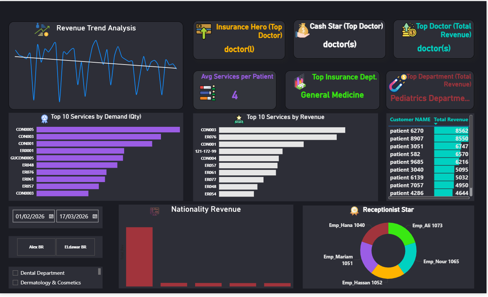
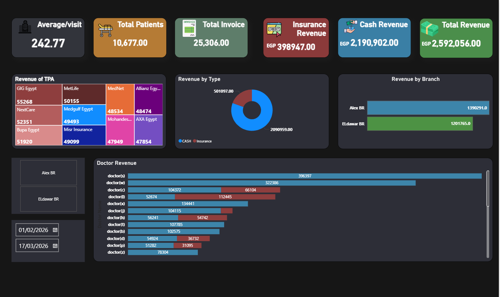

# 🏥 Comprehensive Hospital Analytics Report (Power BI)

## 📊 About the Project
This project transforms raw medical data into a 2-page interactive dashboard to track financial growth and operational efficiency across multiple branches.

## 📄 Dashboard Pages

### 1️⃣ Operational Overview
Focuses on the high-level KPIs:
- **Metrics:** Total Revenue, Average Visit Cost, and Patient Count.
- **TPA Analysis:** Breakdown of revenue by insurance providers (GIG, MetLife, etc.).
- **Branch Performance:** Comparing revenue between Alex and ElDawar branches.

### 2️⃣ Performance Analysis
Deep dive into staff and service efficiency:
- **Revenue Trends:** Daily flow of income.
- **Top Doctors:** Analysis of revenue by medical staff.
- **Service Demand:** Top 10 services requested by patients.
- **Receptionist Stars:** Employee performance tracking.

## 📸 Project Previews

### Operational Dashboard

### Performance Dashboard

## 🛠️ Skills Demonstrated
- Data Cleaning (Power Query)
- Data Modeling
- Advanced DAX Measures
- UI/UX Design in Power BI
